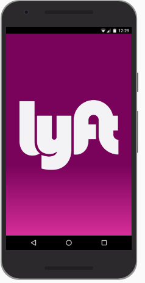
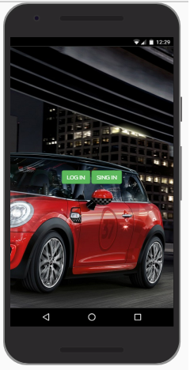
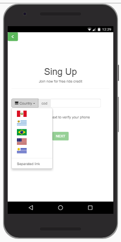
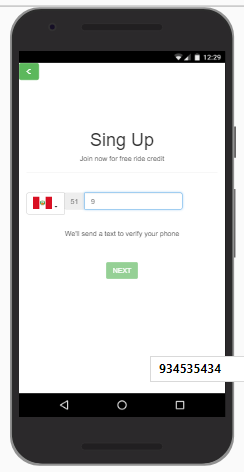
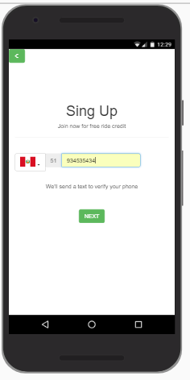
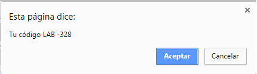
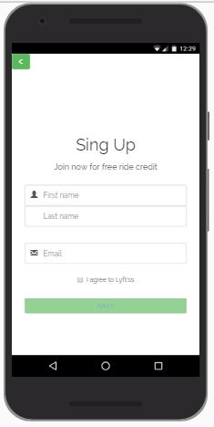

# LYFT

> Prototipo de una aplicación movil para Lyft, que tiene la finalidad de inscribir a los conductores , que garantice un registro correcto de su nró de celular, el cual se verifica con el envío de un código de seguridad, luego se podrán finalmente registrar nombre, apellido y email del conductor.

## Instalación De Demo

Clonar el Repositorio, utilizando los comandos git clone: [https://github.com/yennyelizabeth/reto-lyft.git]

## Ejemplo de uso

- Las vistas de la demo tienen las siguientes secuencia de vistas:

## Configuración de desarrollo

La clonación genera la estructura de carpetas y archivos necesarios.

## Herramientas utilizadas

* Javascript Vanila para la funcionalidad ( elaboración propia )
* Bootstrap vs 3.3.7 para estilos y diseño responsive ( librería )
* Css para los estilos ( elaboración propia )
* Html Vs 5 para el marcado ( elaboración propia )
* Visual Studio Code vs 1.18.1 para el desarrollo.

## Historial de versiones

* 0.0.1 Actualmente está disponible la 1era versión, la cual todavía no está ajustada en 
funcionalidad y diseño, por ser un prototipo.

## Meta

Yenny Quiñones – [@TuTwitter](https://twitter.com/dbader_org) – yenny.elizabeth@hotmail.com

Distribuido bajo la licencia XYZ. Ver ``LICENSE`` para más información.

[https://github.com/yennyelizabeth/reto-food-map](https://yennyelizabeth.github.io/reto-food-map/)

